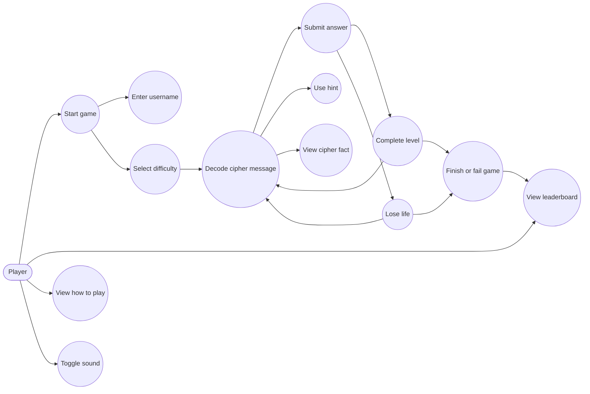
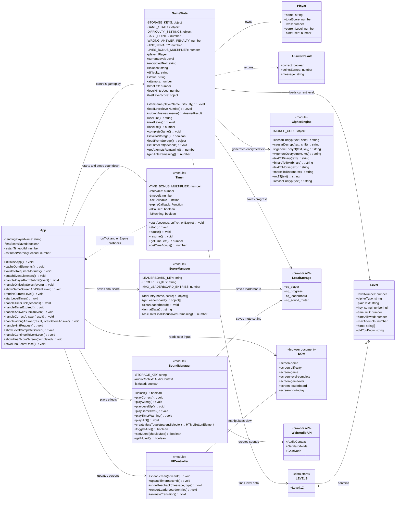
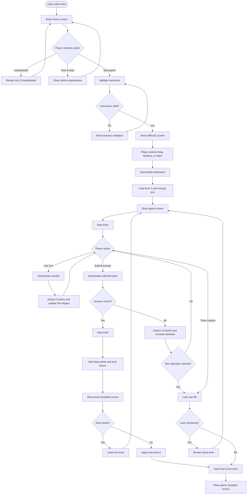
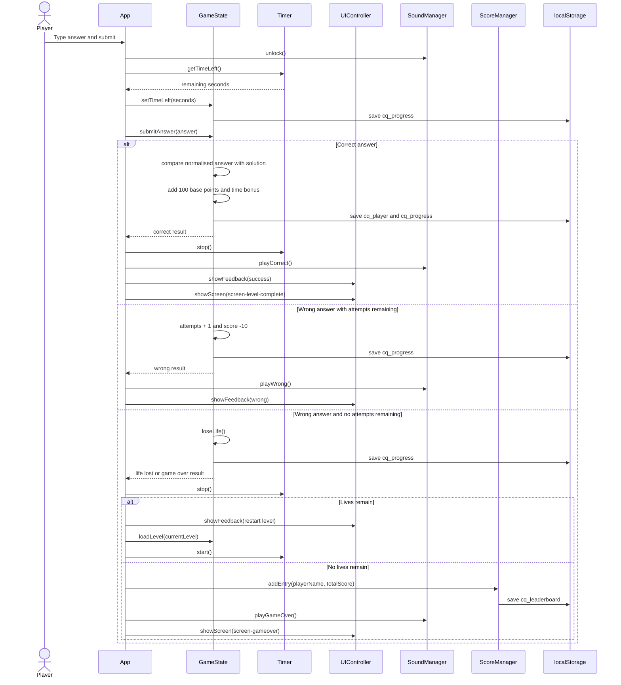
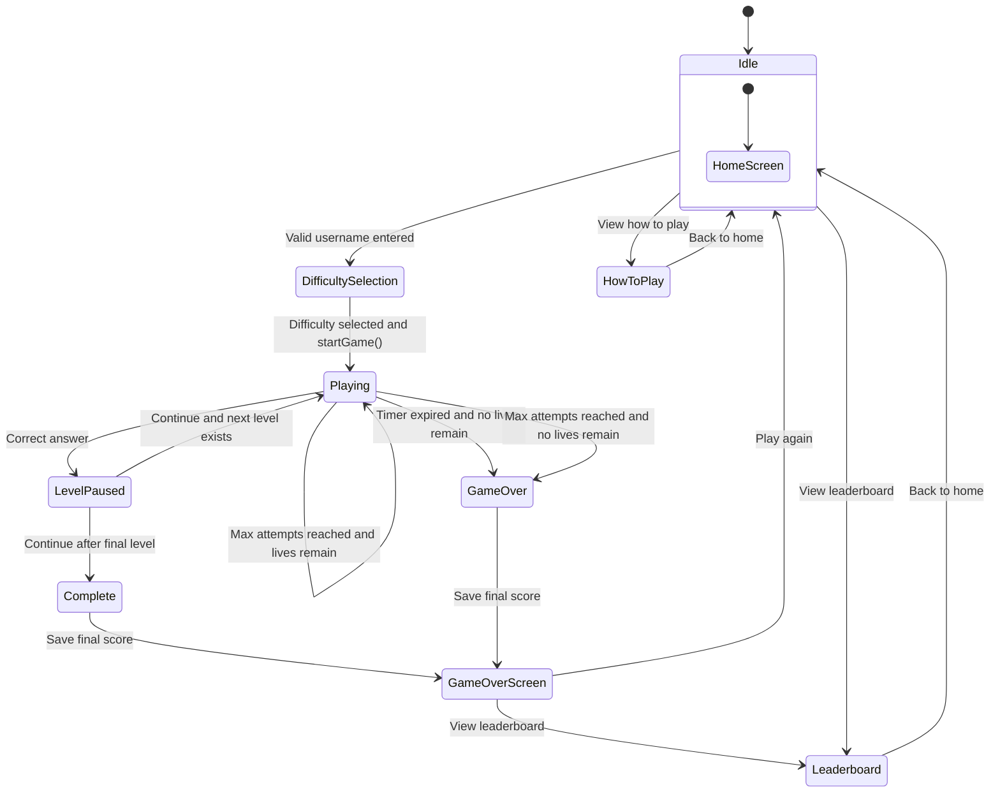
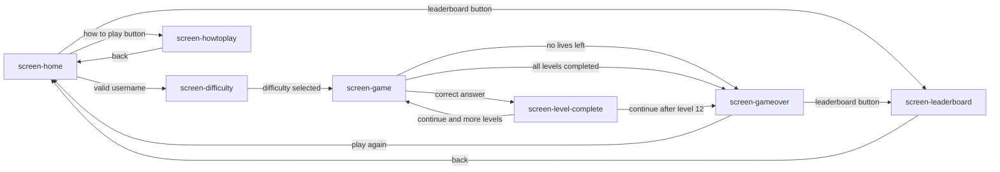
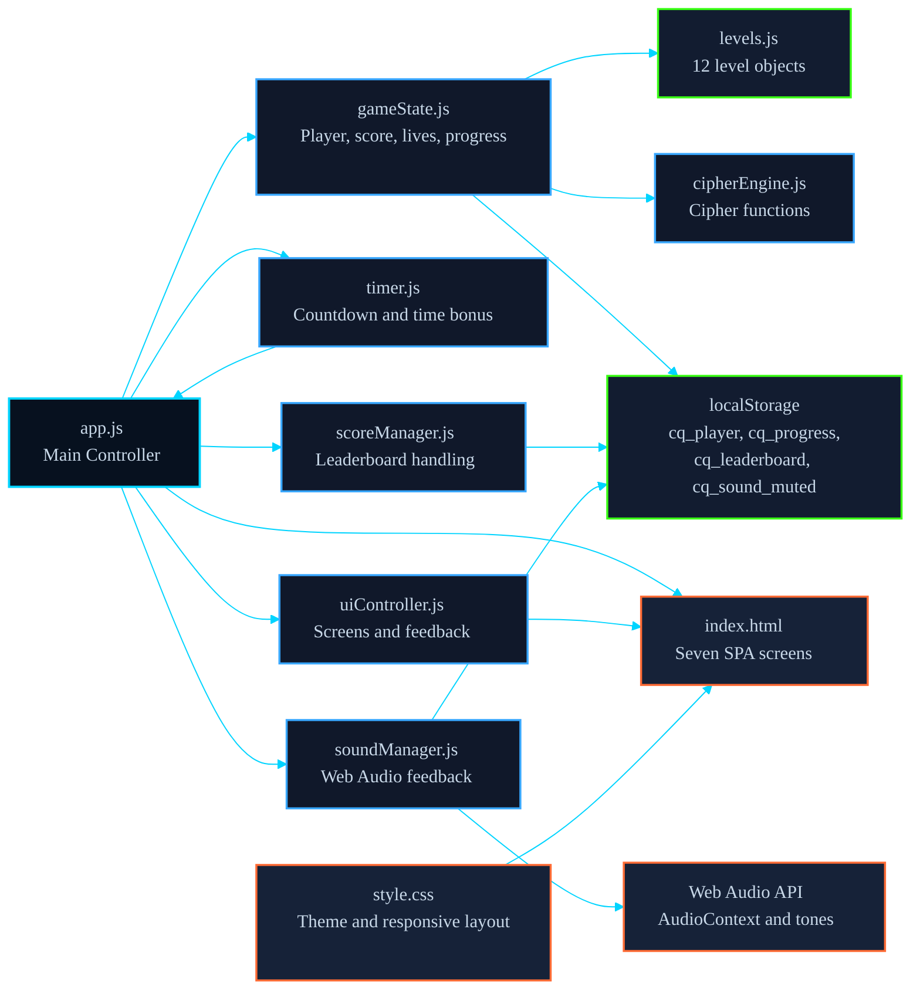

# Cipher Quest UML Diagrams

This UML set is based on the current Cipher Quest implementation. The JavaScript code uses IIFE module objects rather than ES6 classes, so each module is represented as a UML class or component for design documentation.

## 1. Use Case Diagram

## 2. Class Diagram

## 3. Main Gameplay Activity Diagram

## 4. Answer Submission Sequence Diagram

## 5. Game State Machine Diagram

## 6. Screen Navigation Diagram

## 7. Relations of the files

